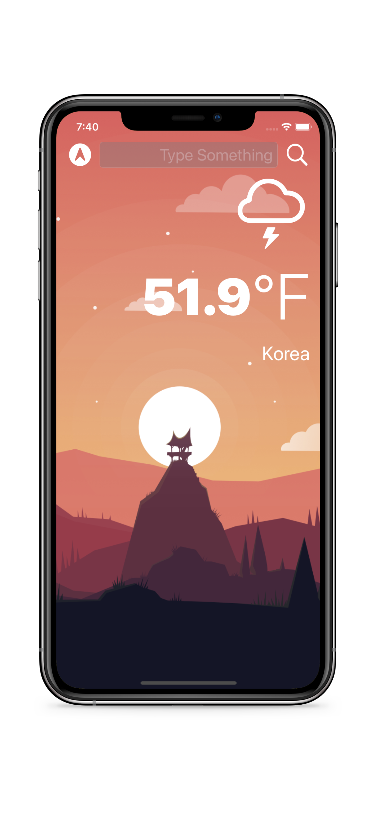
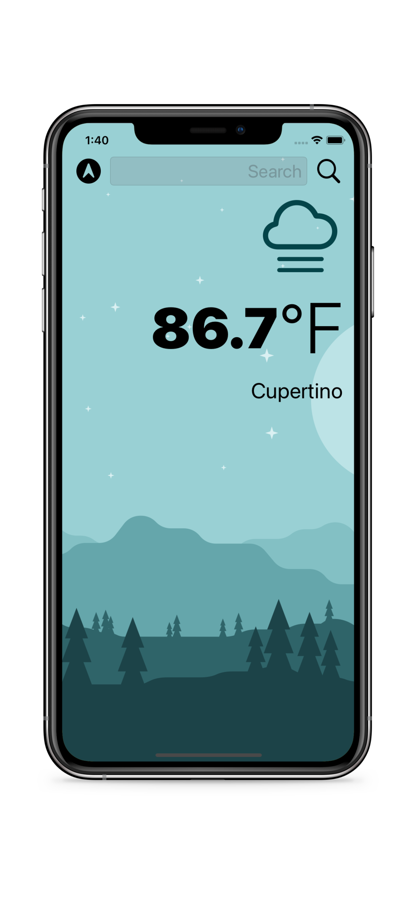
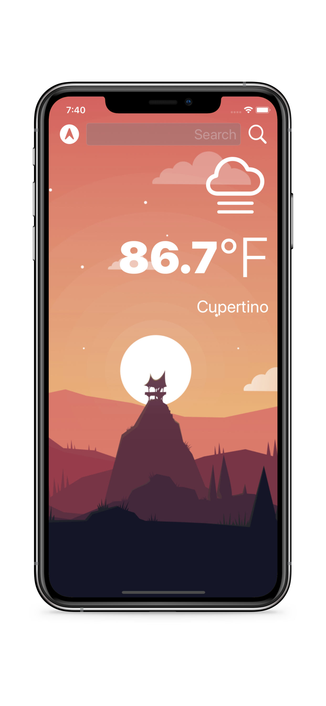

# Weather App

Weather App is a an IOS App that finds your current location and gives you weather data. You are also able to search for weather data for various locations

## Usage

1. Allow location access on your iphone when the app launches
1. Type the name of the location on the top bar
1. Press search to get the weather data for that location

## Contributing
Pull requests are welcome. For any changes, please open an issue first to discuss what you would like to change.
